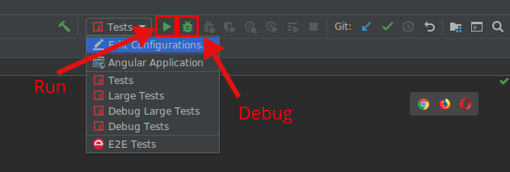

<!--
  BEFORE UPDATING THIS FILE, READ THIS.

  This file is automatically generated during release. It is important for you to not update
  README directly.

  - If you need to change the content, update `scripts/templates/readme.ejs`
  - If you need to add/remove a package or a link, update the .monorepo.json file instead.

  Any changes to README.md directly will result in a failure on CI.
-->

# Angular CLI
### Development tools and libraries specialized for Angular

This is the home of the DevKit and the Angular CLI code. You can find the Angular CLI specific README
[here](/packages/angular/cli/README.md).


[](https://circleci.com/gh/angular/angular-cli) [](https://david-dm.org/angular/angular-cli) [](https://david-dm.org/angular/angular-cli?type=dev) 

[](/LICENSE) 

[](https://github.com/angular/angular-cli/fork) [](https://github.com/angular/angular-cli) 


### Quick Links
[Gitter](https://gitter.im/angular/angular-cli) | [Contributing](/CONTRIBUTING.md) | [Angular CLI](http://github.com/angular/angular-cli) | 
|---|---|---|

----

## The Goal of Angular CLI

The Angular CLI creates, manages, builds and test your Angular projects. It's built on top of the
Angular DevKit.

## The Goal of DevKit

DevKit's goal is to provide a large set of libraries that can be used to manage, develop, deploy and
analyze your code.

# Getting Started - Local Development

## Installation

To get started locally, follow these instructions:

1. If you haven't done it already, [make a fork of this repo](https://github.com/angular/angular-cli/fork).
1. Clone to your local computer using `git`.
1. Make sure that you have Node 10.13 or later installed. See instructions [here](https://nodejs.org/en/download/).
1. Make sure that you have `yarn` installed; see instructions [here](https://yarnpkg.com/lang/en/docs/install/).
1. Run `yarn` (no arguments) from the root of your clone of this project to install dependencies.

## Building and Installing the CLI

To make a local build:

```shell
yarn build --local
```

This generates a number of tarballs in the `dist/` directory. To actually use
the locally built tools, switch to another repository reproducing the specific
issue you want to fix (or just generate a local repo with `ng new`). Then
install the locally built packages:

```shell
cd "${EXAMPLE_ANGULAR_PROJECT_REPO}"
npm install -D ${CLI_REPO}/dist/*.tgz
```

Builds of this example project will use tooling created from the previous local
build and include any local changes. When using the CLI, it will automatically
check for a local install and use that if present. This means you can just run:

```shell
npm install -g @angular/cli
```

to get a global install of the latest CLI release. Then running any `ng` command
in the example project will automatically find and use the local build of the
CLI.

Note: If you are testing `ng update`, be aware that installing all the tarballs
will also update the framework (`@angular/core`) to the latest version. In this
case, simply install the CLI alone with
`npm install -D ${CLI_REPO}/dist/_angular_cli.tgz`, that way the rest of the
project remains to be upgraded with `ng update`.

## Debugging

To debug an invocation of the CLI, [build and install the CLI for an example
project](#building-and-installing-the-cli), then run the desired `ng` command
as:

```shell
node --inspect-brk node_modules/.bin/ng ...
```

This will trigger a breakpoint as the CLI starts up. You can connect to this
using the supported mechanisms for your IDE, but the simplest option is to open
Chrome to [chrome://inspect](chrome://inspect) and then click on the `inspect`
link for the `node_modules/.bin/ng` Node target.

Unfortunately, the CLI dynamically `require()`'s other files mid-execution, so
the debugger is not aware of all the source code files before hand. As a result,
it is tough to put breakpoints on files before the CLI loads them. The easiest
workaround is to use the `debugger;` statement to stop execution in the file you
are interested in, and then you should be able to step around and set breakpoints
as expected.

## Testing

There are two different test suites which can be run locally:

### Unit tests
  * Run all tests: `yarn bazel test //packages/...`
  * Run a subset of the tests, use the full Bazel target example: `yarn bazel test //packages/schematics/angular:angular_test`
  * For a complete list of test targets use the following Bazel query: `yarn bazel query "tests(//packages/...)"`

You can find more info about debugging [tests with Bazel in the docs.]
(https://github.com/angular/angular-cli/blob/master/docs/process/bazel.md#debugging-jasmine_node_test)  

### End to end tests
  * Run: `node tests/legacy-cli/run_e2e.js`
  * Run a subset of the tests: `node tests/legacy-cli/run_e2e.js tests/legacy-cli/e2e/tests/i18n/ivy-localize-*`

When running the debug commands, Node will stop and wait for a debugger to attach.
You can attach your IDE to the debugger to stop on breakpoints and step through the code. Also, see [IDE Specific Usage](#ide-specific-usage) for a
simpler debug story.

When debugging a specific test, change `describe()` or `it()` to `fdescribe()`
and `fit()` to focus execution to just that one test. This will keep the output clean and speed up execution by not running irrelevant tests.

## IDE Specific Usage

Some additional tips for developing in specific IDEs.

### Intellij IDEA / WebStorm

To load the project in Intellij products, simply `Open` the repository folder.
Do **not** `Import Project`, because that will overwrite the existing
configuration.

Once opened, the editor should automatically detect run configurations in the
workspace. Use the drop down to choose which one to run and then click the `Run`
button to start it. When executing a debug target, make sure to click the
`Debug` icon to automatically attach the debugger (if you click `Run`, Node will
wait forever for a debugger to attach).



## Creating New Packages

Adding a package to this repository means running two separate commands:

1. `schematics devkit:package PACKAGE_NAME`. This will update the `.monorepo` file, and create the
  base files for the new package (package.json, src/index, etc).
1. `devkit-admin templates`. This will update the README and all other template files that might
  have changed when adding a new package.

For private packages, you will need to add a `"private": true` key to your package.json manually.
This will require re-running the template admin script.

# Packages

This is a monorepo which contains many tools and packages:


## Tools

| Project | Package | Version | Links |
|---|---|---|---|
**Angular CLI** | [`@angular/cli`](https://npmjs.com/package/@angular/cli) | [](https://npmjs.com/package/@angular/cli) | [](/packages/angular/cli/README.md) [](https://github.com/angular/cli-builds)
**Architect CLI** | [`@angular-devkit/architect-cli`](https://npmjs.com/package/@angular-devkit/architect-cli) | [](https://npmjs.com/package/@angular-devkit/architect-cli) |  [](https://github.com/angular/angular-devkit-architect-cli-builds)
**Schematics CLI** | [`@angular-devkit/schematics-cli`](https://npmjs.com/package/@angular-devkit/schematics-cli) | [](https://npmjs.com/package/@angular-devkit/schematics-cli) |  [](https://github.com/angular/angular-devkit-schematics-cli-builds)


## Packages


| Project | Package | Version | Links |
|---|---|---|---|
**Architect** | [`@angular-devkit/architect`](https://npmjs.com/package/@angular-devkit/architect) | [](https://npmjs.com/package/@angular-devkit/architect) | [](/packages/angular_devkit/architect/README.md) [](https://github.com/angular/angular-devkit-architect-builds)
**Build Angular** | [`@angular-devkit/build-angular`](https://npmjs.com/package/@angular-devkit/build-angular) | [](https://npmjs.com/package/@angular-devkit/build-angular) | [](/packages/angular_devkit/build_angular/README.md) [](https://github.com/angular/angular-devkit-build-angular-builds)
**Build Optimizer** | [`@angular-devkit/build-optimizer`](https://npmjs.com/package/@angular-devkit/build-optimizer) | [](https://npmjs.com/package/@angular-devkit/build-optimizer) | [](/packages/angular_devkit/build_optimizer/README.md) [](https://github.com/angular/angular-devkit-build-optimizer-builds)
**Build Webpack** | [`@angular-devkit/build-webpack`](https://npmjs.com/package/@angular-devkit/build-webpack) | [](https://npmjs.com/package/@angular-devkit/build-webpack) | [](/packages/angular_devkit/build_webpack/README.md) [](https://github.com/angular/angular-devkit-build-webpack-builds)
**Core** | [`@angular-devkit/core`](https://npmjs.com/package/@angular-devkit/core) | [](https://npmjs.com/package/@angular-devkit/core) | [](/packages/angular_devkit/core/README.md) [](https://github.com/angular/angular-devkit-core-builds)
**Schematics** | [`@angular-devkit/schematics`](https://npmjs.com/package/@angular-devkit/schematics) | [](https://npmjs.com/package/@angular-devkit/schematics) | [](/packages/angular_devkit/schematics/README.md) [](https://github.com/angular/angular-devkit-schematics-builds)

#### Schematics

| Project | Package | Version | Links |
|---|---|---|---|
**Angular PWA Schematics** | [`@angular/pwa`](https://npmjs.com/package/@angular/pwa) | [](https://npmjs.com/package/@angular/pwa) |  [](https://github.com/angular/angular-pwa-builds)
**Angular Schematics** | [`@schematics/angular`](https://npmjs.com/package/@schematics/angular) | [](https://npmjs.com/package/@schematics/angular) |  [](https://github.com/angular/schematics-angular-builds)
**Schematics Schematics** | [`@schematics/schematics`](https://npmjs.com/package/@schematics/schematics) | [](https://npmjs.com/package/@schematics/schematics) |  [](https://github.com/angular/schematics-schematics-builds)
**Package Update Schematics** | [`@schematics/update`](https://npmjs.com/package/@schematics/update) | [](https://npmjs.com/package/@schematics/update) |  [](https://github.com/angular/schematics-update-builds)

#### Misc

| Project | Package | Version | Links |
|---|---|---|---|
**Webpack Angular Plugin** | [`@ngtools/webpack`](https://npmjs.com/package/@ngtools/webpack) | [](https://npmjs.com/package/@ngtools/webpack) |  [](https://github.com/angular/ngtools-webpack-builds)


